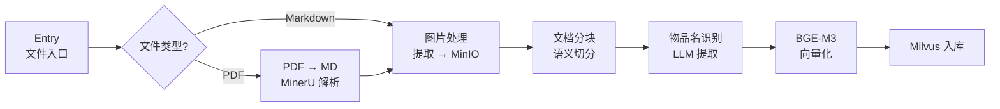
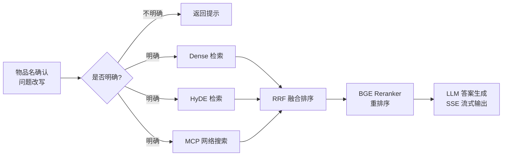

# 📚 逸云智库 — 基于 LangGraph 的 RAG 知识库问答系统

一个面向企业级设备手册的知识库检索增强生成（RAG）系统，支持 PDF/Markdown 文档的自动化导入、多路混合检索、重排序与流式问答。

[](https://www.python.org/)
[](https://fastapi.tiangolo.com/)
[](https://langchain-ai.github.io/langgraph/)
[](https://milvus.io/)

---

## 🏗️ 系统架构

```
┌──────────────────────────────────────────────────────────────────┐
│                        用户 / 前端                                │
│                (chat.html / import.html)                         │
└──────────────┬──────────────────────────────┬────────────────────┘
               │                              │
       ┌───────▼───────┐              ┌───────▼───────┐
       │  Query Service │              │ Import Service │
       │  (Port 8001)   │              │  (Port 8000)   │
       │  FastAPI + SSE │              │    FastAPI     │
       └───────┬───────┘              └───────┬───────┘
               │                              │
       ┌───────▼────────────────────┐  ┌──────▼─────────────────────┐
       │   Query Graph (LangGraph)  │  │  Import Graph (LangGraph)  │
       │                            │  │                            │
       │  ① Item Name Confirm       │  │  ① Entry (文件入口)         │
       │  ② 三路并行召回:            │  │  ② PDF → Markdown (MinerU) │
       │    · Dense Vector Search   │  │  ③ 图片处理                 │
       │    · HyDE Search           │  │  ④ 文档分块                 │
       │    · Web Search (MCP)      │  │  ⑤ 物品名识别 (LLM)         │
       │  ③ RRF 融合排序             │  │  ⑥ BGE-M3 向量化            │
       │  ④ BGE Reranker 重排序      │  │  ⑦ 导入 Milvus              │
       │  ⑤ 答案生成 (LLM)           │  │                            │
       └───────┬────────────────────┘  └──────┬─────────────────────┘
               │                              │
       ┌───────▼──────────────────────────────▼─────────────────────┐
       │                      基础设施层                              │
       │  ┌──────────┐  ┌──────────┐  ┌──────────┐  ┌──────────┐  │
       │  │  Milvus  │  │  MinIO   │  │ MongoDB  │  │  MCP     │  │
       │  │ 向量数据库│  │ 对象存储  │  │ 对话历史  │  │ 网络搜索  │  │
       │  └──────────┘  └──────────┘  └──────────┘  └──────────┘  │
       └────────────────────────────────────────────────────────────┘
```

## ✨ 核心特性

### 📥 文档导入流水线

- **PDF 解析**：集成 [MinerU](https://mineru.net) 将 PDF 转为 Markdown，保留文档结构
- **图片处理**：自动提取并转存 Markdown 中的图片至 MinIO 对象存储
- **智能分块**：支持基于文档层级的语义分块策略
- **物品名识别**：利用 LLM 自动从文档中提取核心物品/设备名称，用于后续检索过滤
- **混合向量化**：使用 **BGE-M3** 模型生成稠密（Dense）+ 稀疏（Sparse）混合向量
- **Milvus 入库**：支持标量过滤 + 混合向量索引

### 🔍 查询检索流水线

- **问题改写**：利用 LLM 对用户问题进行改写和物品名提取
- **三路并行召回**：
  - **Dense 向量检索** — 基于 BGE-M3 稠密 + 稀疏混合检索
  - **HyDE 检索** — 生成假设文档再检索，缓解语义鸿沟
  - **网络搜索** — 通过阿里云百炼 MCP 进行联网搜索补充
- **RRF 融合**（Reciprocal Rank Fusion）：合并多路召回结果
- **BGE Reranker 重排序**：使用 BGE-Reranker-Large 精选 Top-K 文档
- **流式问答**：基于 SSE（Server-Sent Events）实时推送生成结果
- **对话历史**：MongoDB 持久化存储，支持多轮对话

### 🛠️ 工程化能力

- **LangGraph 状态图**：可视化工作流，节点解耦，易于扩展
- **FastAPI 异步服务**：支持文件上传异步处理、SSE 流式推送
- **任务进度追踪**：前端可实时轮询每个节点的执行状态
- **统一日志**：Loguru + `.env` 配置，支持控制台/文件双输出及自动轮转
- **LLM 客户端缓存**：全局单例 + 缓存池，避免重复初始化

## 📦 技术栈

| 类别 | 技术选型 | 说明 |
|------|---------|------|
| **LLM** | Qwen-Flash / Qwen3-VL-Flash | 通过阿里云 DashScope (百炼) 兼容接口调用 |
| **Embedding** | BAAI/BGE-M3 | 稠密 + 稀疏混合向量，1024 维 |
| **Reranker** | BAAI/BGE-Reranker-Large | 对候选文档精细重排序 |
| **向量数据库** | Milvus 2.6+ | 混合向量检索 + 标量过滤 |
| **对象存储** | MinIO | 存储文档图片等静态资源 |
| **对话存储** | MongoDB | 持久化多轮对话历史 |
| **PDF 解析** | MinerU | 高精度 PDF → Markdown |
| **编排框架** | LangGraph 1.1+ | 状态图驱动的工作流编排 |
| **Web 框架** | FastAPI + Uvicorn | 异步 HTTP + SSE 流式 |
| **网络搜索** | MCP (阿里云百炼) | 通过 MCP 协议调用联网搜索 |
| **日志** | Loguru | 彩色控制台 + 文件自动轮转 |

## 🚀 快速开始

### 前置依赖

- Python 3.11+
- Milvus 向量数据库实例
- MinIO 对象存储实例
- MongoDB 实例
- 阿里云百炼 (DashScope) API Key
- MinerU API Token
- CUDA 环境的 GPU

### 1. 克隆项目

```bash
git clone https://github.com/your-username/rag-knowledge-base.git
cd rag-knowledge-base
```

### 2. 安装依赖

```bash
pip install -e .
```

### 3. 配置环境变量

```bash
cp .env.example .env
```

编辑 `.env` 文件，填入真实的配置信息：

```ini
# ===================== LLM 配置 =====================
OPENAI_API_KEY=<your-dashscope-api-key>
OPENAI_BASE_URL=https://dashscope.aliyuncs.com/compatible-mode/v1
LLM_DEFAULT_MODEL=qwen-flash
VL_MODEL=qwen3-vl-flash

# ===================== Embedding 模型 =====================
BGE_M3_PATH=/path/to/models/BAAI/bge-m3
BGE_DEVICE=cuda:0
BGE_FP16=1

# ===================== Milvus =====================
MILVUS_URL=http://<your-milvus-host>:19530
CHUNKS_COLLECTION=kb_chunks
EMBEDDING_DIM=1024

# ===================== MongoDB =====================
MONGO_URL=mongodb://<your-mongo-host>:27017
MONGO_DB_NAME=kb002

# ===================== MinIO =====================
MINIO_ENDPOINT=<your-minio-host>:9000
MINIO_ACCESS_KEY=<your-minio-access-key>
MINIO_SECRET_KEY=<your-minio-secret-key>
MINIO_BUCKET_NAME=knowledge-base-files

# ===================== Reranker =====================
BGE_RERANKER_LARGE=/path/to/models/BAAI/bge-reranker-large
BGE_RERANKER_DEVICE=cuda:0
BGE_RERANKER_FP16=1

# ===================== MinerU =====================
MINERU_API_TOKEN=<your-mineru-jwt-token>
MINERU_BASE_URL=https://mineru.net/api/v4
```

### 4. 下载模型（可选）

项目提供了模型下载脚本：

```bash
# 下载 BGE-M3 嵌入模型
python -m app.tool.download_bgem3

# 下载 BGE Reranker 模型
python -m app.tool.download_reranker
```

### 5. 启动服务

**文档导入服务**（端口 8000）：

```bash
python -m app.import_process.api.file_import_service
```

**查询问答服务**（端口 8001）：

```bash
python -m app.query_process.api.query_service
```

### 6. 访问页面

- **文档导入页面**：http://localhost:8000/import
- **问答聊天页面**：http://localhost:8001/chat.html
- **API 文档 (Swagger)**：http://localhost:8000/docs 或 http://localhost:8001/docs

## 📖 API 接口

### 导入服务 (Port 8000)

| 方法 | 路径 | 说明 |
|------|------|------|
| `GET` | `/import` | 文档导入页面 |
| `POST` | `/upload` | 上传文件并开启异步导入流程 |
| `GET` | `/status/{task_id}` | 查询任务处理进度 |

### 查询服务 (Port 8001)

| 方法 | 路径 | 说明 |
|------|------|------|
| `GET` | `/health` | 健康检查 |
| `GET` | `/chat.html` | 问答聊天页面 |
| `POST` | `/query` | 发起提问（支持同步/流式） |
| `GET` | `/stream/{session_id}` | SSE 流式连接 |
| `GET` | `/history/{session_id}` | 查询历史对话 |
| `DELETE` | `/history/{session_id}` | 清空历史对话 |

## 📂 项目结构

```
rag_dataset/
├── app/
│   ├── import_process/           # 📥 文档导入流水线
│   │   ├── agent/
│   │   │   ├── main_graph.py     # LangGraph 导入工作流定义
│   │   │   ├── state.py          # 导入状态数据结构
│   │   │   └── nodes/            # 各处理节点
│   │   │       ├── node_entry.py              # 入口 & 文件校验
│   │   │       ├── node_pdf_to_md.py          # PDF → Markdown
│   │   │       ├── node_md_img.py             # 图片提取 & MinIO 存储
│   │   │       ├── node_document_split.py     # 文档分块
│   │   │       ├── node_item_name_recognition.py  # LLM 物品名识别
│   │   │       ├── node_bge_embedding.py      # BGE-M3 向量化
│   │   │       └── node_import_milvus.py      # Milvus 入库
│   │   └── api/
│   │       └── file_import_service.py  # FastAPI 导入接口
│   │
│   ├── query_process/            # 🔍 查询检索流水线
│   │   ├── agent/
│   │   │   ├── main_graph.py     # LangGraph 查询工作流定义
│   │   │   ├── state.py          # 查询状态数据结构
│   │   │   └── nodes/
│   │   │       ├── node_item_name_confirm.py     # 物品名确认
│   │   │       ├── node_search_embedding.py      # Dense 混合检索
│   │   │       ├── node_search_embedding_hyde.py # HyDE 检索
│   │   │       ├── node_web_search_mcp.py        # MCP 网络搜索
│   │   │       ├── node_rrf.py                   # RRF 融合
│   │   │       ├── node_rerank.py                # BGE 重排序
│   │   │       └── node_answer_output.py         # LLM 答案生成
│   │   └── api/
│   │       └── query_service.py  # FastAPI 查询接口 + SSE
│   │
│   ├── clients/                  # 🔌 外部服务客户端
│   │   ├── milvus_utils.py       # Milvus 向量数据库操作
│   │   ├── minio_utils.py        # MinIO 对象存储操作
│   │   └── mongo_history_utils.py # MongoDB 对话历史
│   │
│   ├── conf/                     # ⚙️ 配置管理
│   │   ├── embedding_config.py   # BGE-M3 配置
│   │   ├── lm_config.py          # LLM 配置
│   │   ├── milvus_config.py      # Milvus 配置
│   │   ├── minio_config.py       # MinIO 配置
│   │   ├── mineru_config.py      # MinerU 配置
│   │   ├── reranker_config.py    # Reranker 配置
│   │   └── bailian_mcp_config.py # MCP 搜索配置
│   │
│   ├── lm/                       # 🧠 模型工具
│   │   ├── embedding_utils.py    # BGE-M3 向量生成（单例）
│   │   ├── lm_utils.py           # LLM 客户端（缓存池）
│   │   └── reranker_utils.py     # Reranker 模型（单例）
│   │
│   ├── core/                     # 🧩 核心模块
│   │   ├── logger.py             # 统一日志配置
│   │   └── load_prompt.py        # Prompt 模板加载器
│   │
│   ├── utils/                    # 🛠️ 工具函数
│   │   ├── task_utils.py         # 任务进度追踪
│   │   ├── sse_utils.py          # SSE 事件推送
│   │   ├── format_utils.py       # 数据格式化
│   │   └── path_util.py          # 路径工具
│   │
│   └── tool/                     # 🔧 独立工具脚本
│       ├── download_bgem3.py     # 下载 BGE-M3 模型
│       └── download_reranker.py  # 下载 Reranker 模型
│
├── prompts/                      # 📝 Prompt 模板
│   ├── answer_out.prompt
│   ├── hyde_prompt.prompt
│   ├── item_name_recognition.prompt
│   └── rewritten_query_and_itemnames.prompt
│
├── doc/                          # 📄 示例文档
├── .env.example                  # 环境变量模板
├── pyproject.toml                # 项目配置 & 依赖
└── README.md
```

## 🔄 工作流详解

### 导入流水线



### 查询流水线



## 🎯 适用场景

- 📖 **设备手册问答**：上传产品 PDF 手册，用自然语言查询操作说明、参数配置
- 🏢 **企业内部知识库**：将分散的技术文档集中管理，提供智能问答入口
- 🔧 **运维支持**：快速检索设备故障排查步骤、配置指南
- 📱 **客服辅助**：为客服人员提供实时知识检索和答案推荐

## 🤝 贡献指南

欢迎提交 Issue 和 Pull Request！

1. Fork 本仓库
2. 创建特性分支 (`git checkout -b feature/amazing-feature`)
3. 提交更改 (`git commit -m 'Add amazing feature'`)
4. 推送到分支 (`git push origin feature/amazing-feature`)
5. 创建 Pull Request


---

<p align="center">
  <b>Built with ❤️ using LangGraph + FastAPI + Milvus</b>
</p>
